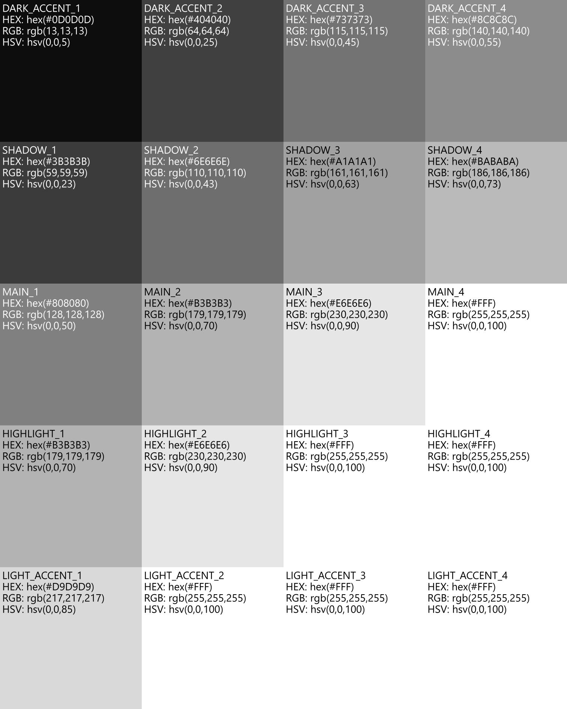
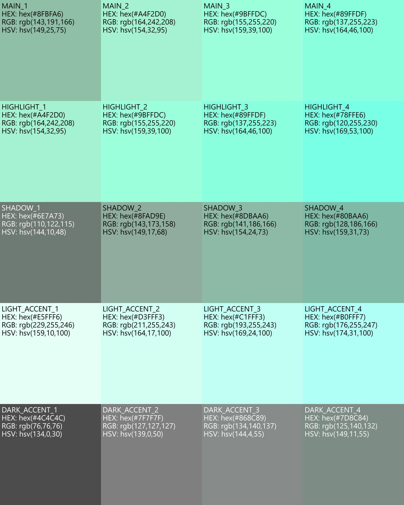
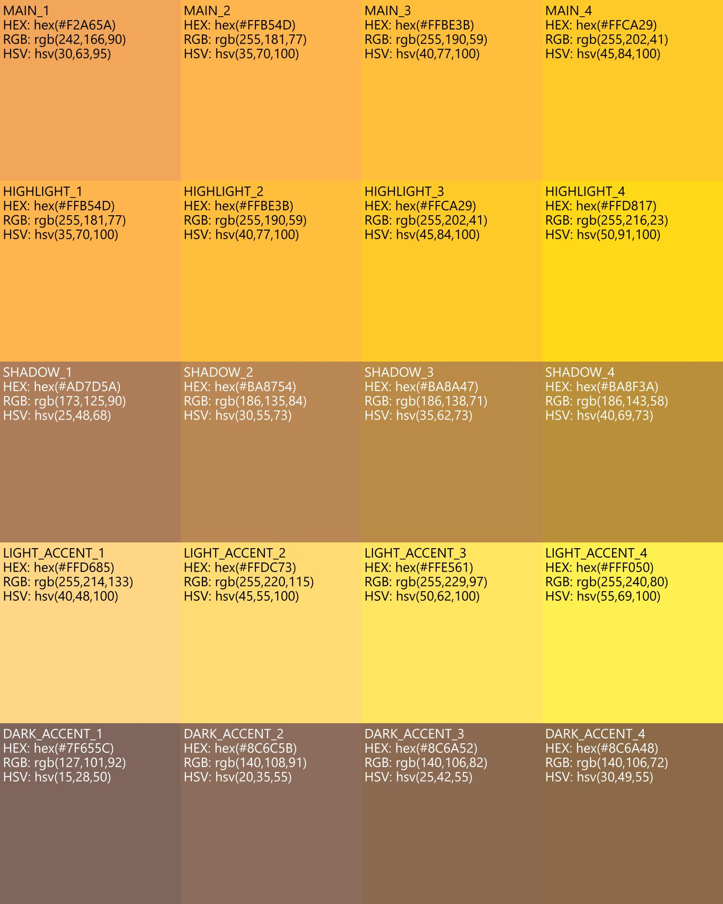

# Docs

## Highlights
- Grayscale mode (`--grayscale`) forces neutral tones and orders swatch rows darkest-to-lightest per multiplier column.
- Swatch tiles include variant name plus hex/rgb/hsv labels, with sizes auto-clamped for readability.
- Grayscale image conversion (`--grayscale-image <path>`) writes image-grayscale-<name> for downstream colorization.

## Swatch gallery
Grayscale (multiplier 4):

Soft sage (rgb(143,191,166), multiplier 4):

Warm sunset (rgb(242,166,90), multiplier 4):

